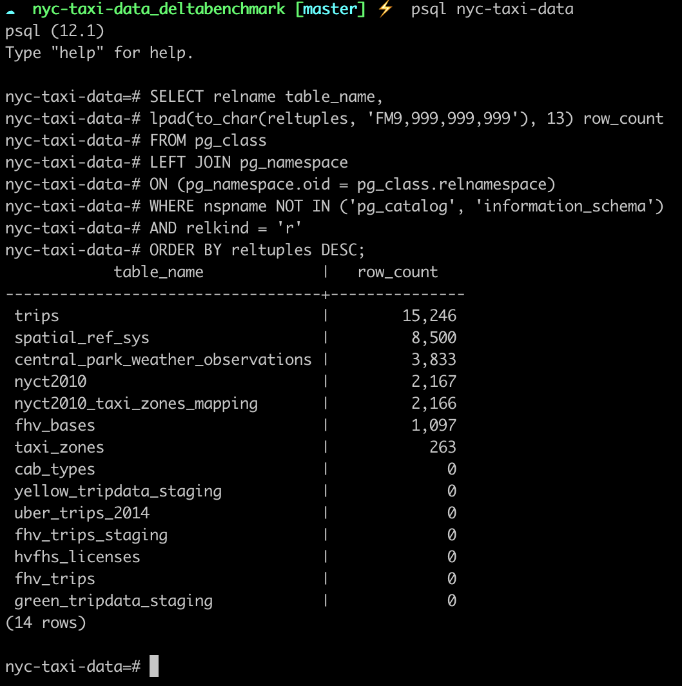
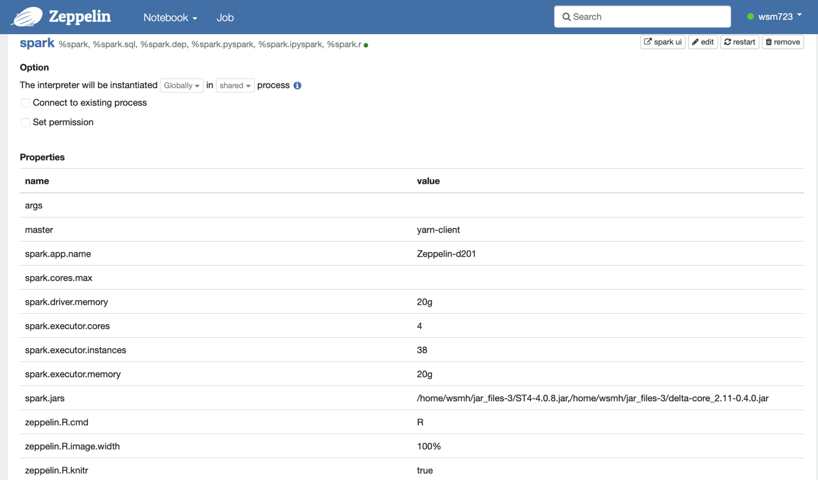
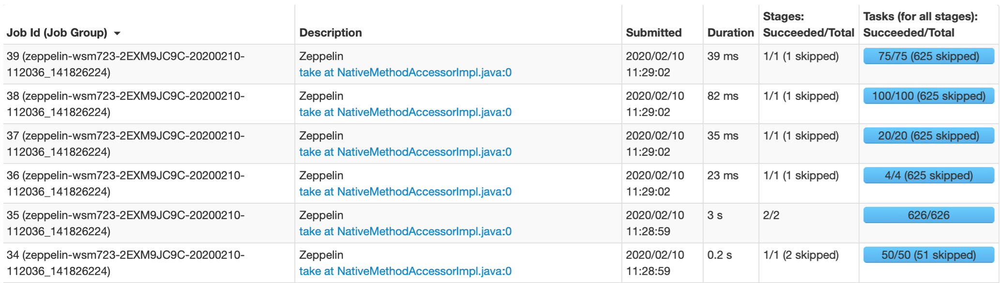

# nyc-taxi-data_deltabenchmark
This repo is mainly about querying nyc-taxi-data with delta lake which is an open source data lake satisfying ACID property.

Almost of uploaded files are from repo: https://github.com/toddwschneider/nyc-taxi-data

Also, data preprocessing and etl steps refer to a blog: https://tech.marksblogg.com/billion-nyc-taxi-rides-redshift.html

## Introduction

The project was measuring query times to benchmark delta lake with my own db.

Originally, many data scientists used nyc-taxi-data dataset which has about 2.45 billion trip datas or portion of it
to measure executuion time of various queries.

However my server environment temporarily didn't serve proxy/vpn so, I needed to work with small portions of this original dataset and preprocess the small dataset on my local pc then, send it to server.

I repeated this work several times and I could get 1.1 billion rows in my server environment and use it to measure queries.

This repo explains some changes of build-up files and preprocessing steps and finally measuring methods I used.

## Dependency

* **local PC)**

postgresql: **12.1**

postgis: **3.0.0**

* **Server)**

spark: **2.4.4**

hadoop: **2.8.5**

delta-core: **delta-core_2.12-0.4.0.jar**

zeppelin: **0.8.2**

## 1. Preprocessing

**1. Download raw data**

**download_raw_data.sh** automatically downloads every trips by wget all urls from **setup_files/raw_data_urls.txt**

However, in my case, the local pc had only about 50GB space available so, I commented out all urls except 2~4 target urls to download small portion of raw dataset.

After comment out all urls except your target urls, execute

	./download_raw_data.sh

downloaded low data files saved in **data** directory.

Yellow taxi trip data files of **2010-02 & 2010-03** contains **bad row** which does not fit in next steps so, you should remove that rows after you download yellow trip data of **2010-02 & 2010-03** using following command.

	./remove_bad_rows.sh

**2. initialize db**

**initialize_database.sh** automatically creates db on postgresql and makes some tables by using exist datasets **data/central_park_weather.csv**, **data/fhv_bases.csv**

In my case, original **initialize_database.sh** made some errors because it uses some functions from postgis to handle nested attributes but, original sh file did not import postgis.

Therefore, I added following two lines after create schema.

	psql nyc-taxi-data -c "CREATE EXTENSION postgis;"
	psql nyc-taxi-data -c "SELECT PostGIS_Version();"

Execute following line to initialize db and some tables in postgresql.

	./initialize_database.sh

**3. import data to postgresql**

**./import_trip_data.sh** automatically import data files in **data** directory to postgresql(db name is nyc-taxi-data).

Execute following command to import data to postgresql.

	./import_trip_data.sh

If the data files successfully imported to postgresql, there should be **'trips'** table and some rows in that table after you use following commands.

	psql nyc-taxi-data

then,

	SELECT relname table_name,
  	lpad(to_char(reltuples, 'FM9,999,999,999'), 13) row_count
	FROM pg_class
	LEFT JOIN pg_namespace
		ON (pg_namespace.oid = pg_class.relnamespace)
	WHERE nspname NOT IN ('pg_catalog', 'information_schema')
	AND relkind = 'r'
	ORDER BY reltuples DESC;

</img>

**4. Preprocessing imported data**

After import trip datas into postgresql, you should merge this table with some previouly exist tables and set or change some column name.

You can do this work after connect to the db **nyc-taxi-data**

	psql nyc-taxi-data

If you connect to the db, you can preprocess and export the imported data with following command. You can also see this command line in **format.txt**

	COPY (
		SELECT trips.cab_type_id,
		 trips.vendor_id,
		 trips.pickup_datetime,
		 trips.dropoff_datetime,
		 trips.store_and_fwd_flag,
		 trips.rate_code_id,
		 trips.pickup_longitude,
		 trips.pickup_latitude,
		 trips.dropoff_longitude,
		 trips.dropoff_latitude,
		 trips.passenger_count,
		 trips.trip_distance,
		 trips.fare_amount,
		 trips.extra,
		 trips.mta_tax,
		 trips.tip_amount,
		 trips.tolls_amount,
		 trips.improvement_surcharge,
		 trips.total_amount,
		 trips.payment_type,
		 trips.trip_type,

		 cab_types.type cab_type,

		 weather.precipitation rain,
		 weather.snow_depth,
		 weather.snowfall,
		 weather.max_temperature max_temp,
		 weather.min_temperature min_temp,
		 weather.average_wind_speed wind,

		 pick_up.gid pickup_nyct2010_gid,
		 pick_up.ctlabel pickup_ctlabel,
		 pick_up.borocode pickup_borocode,
		 pick_up.boroname pickup_boroname,
		 pick_up.ct2010 pickup_t2010,
		 pick_up.boroct2010 pickup_boroct2010,
		 pick_up.cdeligibil pickup_cdeligibil,
		 pick_up.ntacode pickup_ntacode,
		 pick_up.ntaname pickup_ntaname,
		 pick_up.puma pickup_puma,

		 drop_off.gid dropoff_nyct2010_gid,
		 drop_off.ctlabel dropoff_ctlabel,
		 drop_off.borocode dropoff_borocode,
		 drop_off.boroname dropoff_boroname,
		 drop_off.ct2010 dropoff_ct2010,
		 drop_off.boroct2010 dropoff_boroct2010,
		 drop_off.cdeligibil dropoff_cdeligibil,
		 drop_off.ntacode dropoff_ntacode,
		 drop_off.ntaname dropoff_ntaname,
		 drop_off.puma dropoff_puma
			FROM trips
			LEFT JOIN cab_types
					ON trips.cab_type_id = cab_types.id
			LEFT JOIN central_park_weather_observations weather
					ON weather.date = trips.pickup_datetime::date
			LEFT JOIN nyct2010 pick_up
					ON pick_up.gid = trips.pickup_nyct2010_gid
			LEFT JOIN nyct2010 drop_off
					ON drop_off.gid = trips.dropoff_nyct2010_gid
	) TO PROGRAM
		'gzip > /Users/mf839-033/nyc-taxi-data_deltabenchmark/trips/your_filename.csv.gz'
		WITH CSV;

You can change path of the exported file on second from last line.

**ps) I refer to the blog that I linked to write above command. The original command of the blog did not match with some column name of weather csv file. Therefore, I accordingly changed some column name to finish merging tables successfully.**

**5. Truncate table**

If you are planning repeat above process for many partitions, you should truncate trips table after export the trip datas.

If you don't, trips data will be able to have duplicates and it can also cause lack of memory later.

Therefore, use following command to truncate used tables and prevent above problems.

	TRUNCATE TABLE trips;

**6. Send csv to server**

Finally, send processed csv file to the server that save datas in hadoop dfs.

Use scp command to csv file. Following is example.

	scp /Your/processed/csv_file/path server_username@server_ip:/Target/file/path

## 2. Hadoop & Spark Environment

Hadoop and Spark environment set up is up to you.

Be sure to use the most recently updated version of pyspark by using following command. It is essential to use delta core in next step.

	pip install --upgrade pyspark

In my case, my server couldn't use internet so, I first download spark at the local mac pc and used pip upgrade command to update pyspark.

Then, I sent whole spark directory to Linux server.

It has no problem because spark for Unix shows same behaviors on both mac and Linux.

If you can use internet in your server, just use the most simplest way to set up hadoop and spark.

## 3. Zeppelin set up

First, download zeppelin and set up essential configurations such as zeppelin server url port or spark home etc)

Then, connect to zeppelin server port url and log in with your account. Now you can change your zeppelin spark interpreter.

Add your delta core jar file's path to jars.

Also, set up your spark Master and executor cores or instances.

## 4. Measuring

**1. Load files to hadoop dfs**
Create your data storage in your hadoop dfs.

	hadoop fs -mkdir nyc-taxi-data

Unzip your csv.gz files and put the csv results to your hadoop distributed file system.

	hadoop fs -put /your/file/path.csv.gz nyc-taxi-data

Now, you can load dataframe with your data files on zeppelin from your server's hadoop dfs.

**2. Load dataframe on zeppelin notebook**
Make new spark project on zeppelin and write following paragraph to load dataframe and set column names and column types. The paragraph finally convert the df to delta table.

Then, make a new paragraph and create a table using delta from your delta table which was made in previous step.

**3. Try queries**
Now you can use this table to query. For example, I made following 4 queries which are used in the blog that I refered.

Each query is written in a separated paragraph and you can see the result of query with various format by using zeppelin's tools.

**4. Measure execution time**
You can check each query's sub tasks and execution time to finish each tasks in spark jobs url. (In my case http://my_ip:4044)

Following picture shows interface of spark jobs web site. You can easily add all tasks' execution time and the result is the taken time to query.

For example, my example query 1 had **6 tasks** and total taken time was **0.039 + 0.082 + 0.035 + 0.023 + 3 + 0.2 = 3.379 (sec)**

## 5. Comment
Almost of preprocessing processes refer to commented git hub repo and blog post. Thanks to both guys. Those sources also give you many insights or help.

If you have some trouble during set up hadoop/spark/zeppelin, contact me with an E-mail or issue tab. I will give you help as much as I can.

## 6. Contact

Send E-mail to wsm723@kaist.ac.kr or contact with issue tab
